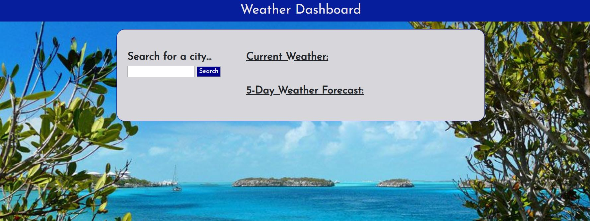
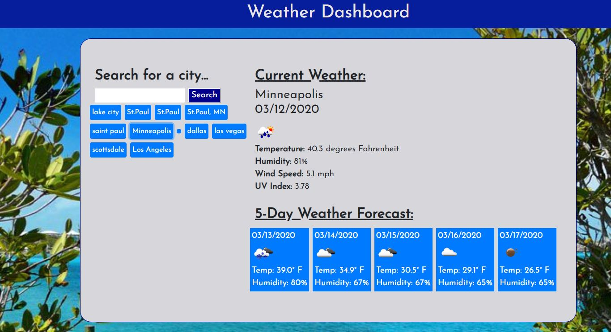

# Weather-Dashboard

Developers are often tasked with retrieving data from another application's API and using it in the context of their own. Third-party APIs allow developers to access their data and functionality by making requests with specific parameters to a URL.
This is my first project attempt at utilizing AJAX and JSON with the weather API.   The user will be able to enter a city in the search box.  It will display the current weather conditions and also append the search.  The application will also be able to display a 5-day forecast.  

## Goal

Build a weather dashboard application with search functionality to find current weather conditions and the future weather outlook for multiple cities.

## User Story

As a traveler
I want to see the weather outlook for multiple cities
so that I can plan a trip accordingly

## Screenshot

## Motivation

The goal is to continue to improve on JavaScript and various JavaScript libraries.  Also get more familiar with AJAX, JSON, and APIs.  

## How to use? 

Simply click the link below.

https://fluent85.github.io/weather-dashboard/

https://drive.google.com/file/d/1yg6AGaHKO2awjyBHcEHJAw1yMCPlLBiG/view

## Issues and future development

Currently the application works.  I may add some more JavaScript functions to delete pass search history.  I also may add some more CSS.

## Technologies Implemented

HTML 5, CSS, Bootstrap, Google Fonts, jQuery, JavaScript   

## Credits

--Richard Tshabalala